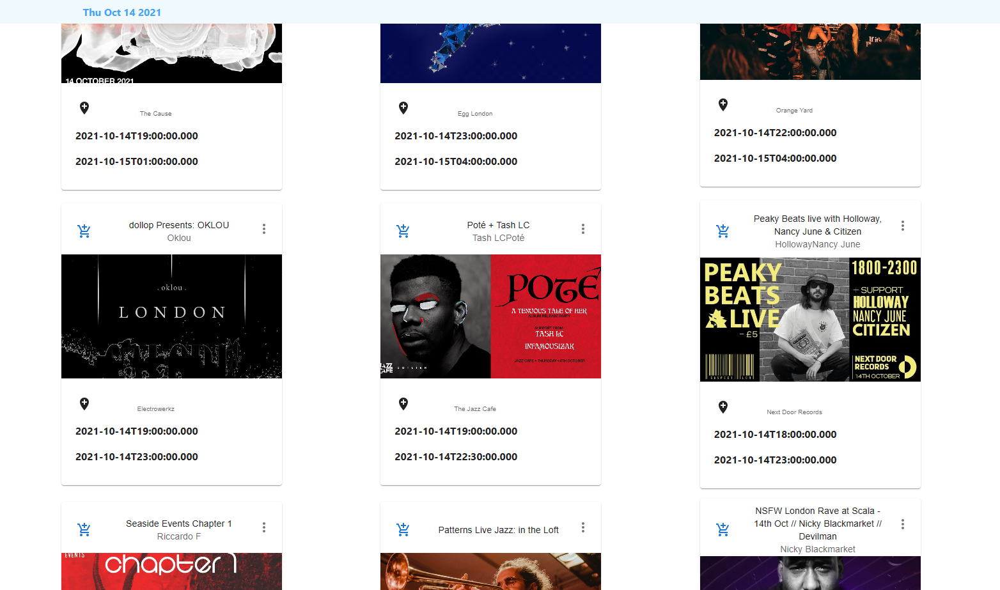

# Getting Started with Create React App

This project was created with [Create React App](https://github.com/facebook/create-react-app).

# TypeScript React Events App 
### The App features: 
A user can scroll to view all available events sorted chnronologically.\
By clicking on the event photo, the user will be directed to a detailed Event page.\
By clicking on the event location, the user will be directed to the address in Google Maps.\
When a user search for an event in the search input, Only events whose titles match with the searching input will stick to the home Page.
### The used tools: 
Web development: Typescript, ReactReact (Components, Props, Events, Hooks, Router ..), ExpressJS, Node.JS, HTML5, CSS....\
The Axios package, promises (async ..await, ..).\
Material UI componenets.
# Installation
npx create-react-app frontend-task --template typescript.\
npm start.\
npm install @mui/material @emotion/react @emotion/styled.
 
### Setting up the Backend

  5.1- create server folder > cd server > npm init -y\
  5.2-  configure TS for the Backend : create tsconfig.json.\
 npm install --save-dev typescript ts-node-dev

  5.3- configure eslint in order to prevent errors \
  npm install --save-dev eslint @typescript-eslint/parser @typescript-eslint/eslint-plugin\
  5.4- create express server (express is a package or dependency or module to create web server on nodejs)\
npm install express\
npm install --save-dev @types/express
  

# Run the project
## 1. Frontend Part
cd client .\
npm start
### `npm start`

Runs the app in the development mode.\
Open [http://localhost:3000](http://localhost:3001) to view it in the browser.

##  2.Backend Part
cd server .\
npm run dev
### `npm run dev`
Runs the nodejs server of the app.

## Learn More

You can learn more in the [Create React App documentation](https://facebook.github.io/create-react-app/docs/getting-started).

To learn React, check out the [React documentation](https://reactjs.org/).
